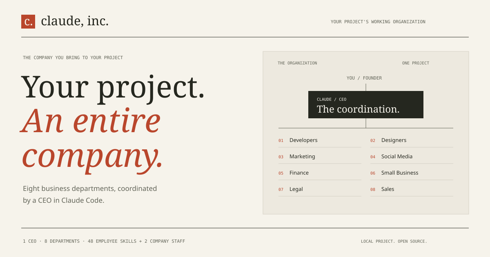
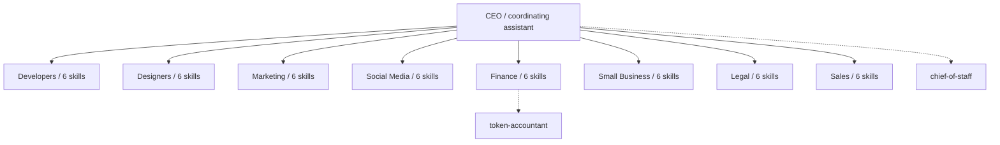

<div align="center">

# Claude, Inc.

### Bring a project. Put the company to work.

**1 CEO · 8 departments · 50 employee skill manuals.**

[](https://github.com/alebgl77/claude-inc/actions/workflows/validate.yml)
[](LICENSE)
[](CONTRIBUTING.md)

</div>

Claude, Inc. organizes a virtual company around your project. The CEO turns your
brief into workstreams, delegates to useful departments, collects files and
review evidence, and resumes from a local project workspace next session. Your
project can be a product, a business operation, a research effort, or something
that spans several departments. You do not have to choose a template first.

The 50 employees are **skill manuals**, not 50 processes running in the
background. Claude Code supplies the active assistant session, native agent
tools, configured model, and permissions. The company supplies its roles,
operating instructions, and a local task-and-decision record.

[](https://alebgl77.github.io/claude-inc/)

[Explore the company](https://alebgl77.github.io/claude-inc/) ·
[Project workspace guide](docs/project-workspace.md) ·
[Architecture and alternatives](docs/architecture.md)

## Hire everyone in 60 seconds

**Claude Code plugin**: install in Claude Code, then open your project folder:

```text
/plugin marketplace add alebgl77/claude-inc
/plugin install claude-inc@claude-inc
/claude-inc:company Build the first version of my appointment-booking business for tutors
```

The CEO clarifies material unknowns and uses the packaged helper to initialize
or resume project state when available. It selects the departments your project
needs; all eight remain available.
Plugin commands use the `claude-inc:` namespace. Directly installed commands
use `/company` instead.

**CLI and local files**: install the company, including the `company` command:

```bash
curl -fsSL https://raw.githubusercontent.com/alebgl77/claude-inc/main/install.sh | bash
```

Or inspect a clone and run its installer:

```bash
git clone https://github.com/alebgl77/claude-inc
cd claude-inc
./install.sh
```

On Windows, run `./install.ps1` from the clone. The installer compiles
`company.exe` locally with the Windows .NET Framework compiler; it requires
Bash, such as Git for Windows. No launcher binary is downloaded. Python 3.9+
is required for project and mission commands; direct Python entry points also
work without Bash. See the
[Windows instructions](docs/project-workspace.md#windows-without-bash).

Use `--brief-file founder-brief.txt` for literal text on Windows PowerShell 5.1:
that shell can alter embedded quotes before a native command receives them.
PowerShell 7 preserves the tested literal arguments. The native launcher
replaces an unchanged, manifest-owned `company.cmd` transactionally; modified
or unowned launchers stop installation for inspection.

Use `./install.sh --project` or `./install.ps1 -Project` to install into the
current project's `.claude/` directory. `--no-bin` / `-NoBin` installs only the
Claude Code files. `-NoBin` neither compiles nor migrates the Windows launcher;
it does not repair an existing `company.cmd`. Installers retain their collision checks and managed-file
transactions; they stop before replacing unmanaged or modified content.
A project install includes `.claude/commands/company.md`; invoke `/company`
explicitly when you want CEO coordination.

## Start your project, then resume the company

From the folder where the actual work belongs:

```bash
company project init --name "Tutor desk" \
  --brief "Build a booking product for independent tutors, from offer to working prototype." \
  --departments developers,designers,marketing \
  --goal "A tutor can create a booking link and a student can request a lesson" \
  --constraint "Use supplied facts; leave publication and purchases to me"

company project start
```

`init` creates `.claude/company/project.json` with your brief, goals, constraints,
and routing preferences. It does not fabricate tasks or alter your onboarding
profile. `start` launches a real Claude Code session in that project with the
packaged company plugin and resume instructions. It uses Claude Code's normal
permissions and configured model; it does not start a daemon or enforce a spend
budget. Claude Code must already be available and configured.

The CEO records task contracts, starts work after its dependencies are accepted,
and delegates with the host's available agent tools. Departments produce actual
files. Submission records the files' SHA-256 hashes and moves a task to review;
an acceptance records a different department or CEO as reviewer and requires
those files to be unchanged. **Hashes establish file identity, not correctness;
reviewer labels are declarations, not authentication.** Review the evidence.

```bash
company project status
company project status --format json
company project start                  # resume from the same folder
company project prompt                 # inspect or copy the resume instructions
```

The [workspace guide](docs/project-workspace.md) covers task commands, blocked
work, review, privacy, and using a different assistant. The structured project
record remains the task source of truth. A Board Memo or Markdown ledger is a
report derived from it.

## The org chart



The CEO owns coordination and serializes project updates. Department agents
apply the relevant employee manuals. Independent assignments can run in
parallel when the host supports it; the company does not assume subagents can
spawn nested subagents. A host without delegation can use explicit department
passes, with that limitation made visible.

## Optional team preferences

Onboarding chooses preferred departments and skills; it does not remove the
rest of the company or create project tasks:

```text
/claude-inc:onboard          # plugin, project profile
/claude-inc:onboard --global # plugin, global profile
company onboard             # CLI onboarding
company team                # inspect active routing preferences
```

Installer users can opt in with `--onboard` or `-Onboard`. With `--no-bin` or
`-NoBin`, onboarding is deferred to the plugin. Project profiles take precedence
over global profiles. `company brief` and `/company` obtain only normalized
scope, departments, and skills from the profile validator, never its free-form
body or research status. An invalid project profile blocks global fallback.
Stored preferences do not authorize network access.
Both commands never read profile files directly.
The plugin form of the CEO command is `/claude-inc:company`; its onboarding and
standup commands are `/claude-inc:onboard` and `/claude-inc:standup`.

Profiles remain separate from `.claude/company/project.json`; project commands
leave `company-team.md` untouched. Saving profiles uses the existing strict
schema, 32,768-byte limit, safe temporary write, and atomic replacement. Replacing
an existing profile still requires the existing explicit replacement option.

## Optional mission recipes

[Mission Studio](https://alebgl77.github.io/claude-inc/missions.html) provides five
starting recipes: `launch`, `validate`, `release`, `proposal`, and `content`.
They are convenient examples inside the broader company, not its boundary.
Open `studio/missions.html` locally or use the terminal:

```bash
company missions
company mission launch --brief "Launch my invoicing app for freelancers" --format prompt
```

Recipes compile a self-contained prompt with selected manuals, staged handoffs,
and evidence checks. They do not initialize your project or execute its tasks.
The browser's cards and preset links omit your edited brief. Manual byte counts
compare source files; they are not token, cost, or runtime estimates. Read the
[Mission Studio guide](docs/mission-studio.md).

## Work with one department

For a focused request, use a department directly:

```bash
company dev "my tests fail after the last refactor"
company legal "review the NDA in nda.md"
company marketing "draft ad variants using the supplied product facts"
```

Skills can also be invoked directly. The CEO is useful when work needs
coordination, dependencies, decisions, or continuity across sessions.

## Meet the company

<details open>
<summary><b>👨‍💻 Developers</b> - VP of Engineering</summary>

| Employee | Role | Superpower |
|---|---|---|
| `superpowers` | Skill Forge | 14-skill power pack |
| `context7` | Docs Fetcher | Live library docs |
| `mcp-builder` | Tool Wright | Wire up MCP servers |
| `skill-creator` | Skill Smith | Build your own skills |
| `webapp-testing` | QA Engineer | Browser-test your app |
| `claude-mem` | Memory Keeper | Persistent memory |

</details>

<details>
<summary><b>🎨 Designers</b> - VP of Design</summary>

| Employee | Role | Superpower |
|---|---|---|
| `ui-ux-pro-max` | Design Lead | Full UI/UX system |
| `taste` | Taste Maker | Design-taste critic |
| `frontend-design` | Front of House | Build front-end UIs |
| `transitions` | Motion Artist | CSS motion library |
| `web-artifacts` | Prototyper | Live web prototypes |
| `brand-guidelines` | Brand Keeper | Build a brand kit |

</details>

<details>
<summary><b>📣 Marketing</b> - CMO</summary>

| Employee | Role | Superpower |
|---|---|---|
| `copywriting` | Word Smith | High-converting copy |
| `ai-seo` | Search Whisperer | Rank in AI search |
| `cro` | Conversion Lead | Lift conversion rates |
| `ad-creative` | Ad Maker | Ad headlines & visuals |
| `customer-research` | Voice of Customer | Synthesise user voice |
| `lead-magnets` | Bait Master | Build lead magnets |

</details>

<details>
<summary><b>📱 Social Media</b> - Head of Social</summary>

| Employee | Role | Superpower |
|---|---|---|
| `post-writer` | Ghostwriter | Write LinkedIn posts |
| `profile-optimizer` | Profile Doctor | Optimise your profile |
| `reels-scripting` | Reel Writer | Script your Reels |
| `hook-generator` | Hook Smith | Scroll-stopping hooks |
| `voice-builder` | Voice Coach | Clone your voice |
| `youtube-thumbnail` | Cover Tester | Test thumbnail covers |

</details>

<details>
<summary><b>💰 Finance</b> - CFO</summary>

| Employee | Role | Superpower |
|---|---|---|
| `financial-statements` | Statement Builder | Build the statements |
| `journal-entry` | Journal Keeper | Post journal entries |
| `reconciliation` | Reconciler | Reconcile the books |
| `variance-analysis` | Variance Analyst | Explain the variances |
| `audit-support` | Auditor | Prep for audit |
| `close-management` | The Closer | Run the close |

</details>

<details>
<summary><b>🏪 Small Business</b> - COO</summary>

| Employee | Role | Superpower |
|---|---|---|
| `cash-flow-snapshot` | Cash Watcher | Snapshot your cash |
| `invoice-chase` | Debt Chaser | Chase late invoices |
| `plan-payroll` | Payroll Planner | Plan payroll |
| `margin-analyzer` | Margin Analyst | Analyse margins |
| `tax-prep` | Tax Prepper | Prep your taxes |
| `run-campaign` | Campaign Runner | Run a campaign |

</details>

<details>
<summary><b>⚖️ Legal</b> - General Counsel</summary>

| Employee | Role | Superpower |
|---|---|---|
| `review-contract` | Contract Reviewer | Review any contract |
| `triage-nda` | NDA Triage | Fast NDA review |
| `compliance-check` | Compliance Officer | Check compliance |
| `legal-risk-assessment` | Risk Assessor | Flag legal risk |
| `vendor-check` | Vendor Vetter | Vet a vendor |
| `signature-request` | Signature Wrangler | Route for signature |

</details>

<details>
<summary><b>🤝 Sales</b> - VP of Sales <i>(Series A hire)</i></summary>

| Employee | Role | Superpower |
|---|---|---|
| `account-research` | Prospector | Actionable prospect intel |
| `draft-outreach` | Cold Emailer | Outreach that earns replies |
| `call-prep` | Deal Prepper | Walk into calls sharp |
| `proposal-builder` | Rainmaker | Proposals that close |
| `objection-handler` | Persuader | Turn pushback into progress |
| `pipeline-review` | Pipeline Doctor | Pipeline truth, weekly plan |

</details>

<details>
<summary><b>🏛️ Executive staff</b> - attached to the C-suite <i>(Series A hires)</i></summary>

| Employee | Reports to | Superpower |
|---|---|---|
| `chief-of-staff` | CEO | Project context, task contracts, decision log, weekly review |
| `token-accountant` | CFO | Reports from observed or supplied usage records |

</details>

## How it works

The company combines native host roles with a small local state helper:

| On the org chart | In this repo | Mechanism |
|---|---|---|
| **CEO** | `commands/company.md`; `/claude-inc:company` in the plugin, `/company` in direct installs | Routing brain: scopes the project, delegates, arbitrates, writes the Board Memo |
| **8 departments** | `agents/*.md` | Native host agents; independent assignments may run in parallel |
| **48 employees** | `skills/*/SKILL.md` | Skills with trigger-rich descriptions; VPs hire them per task, or they self-trigger |
| **2 staff hires** | `chief-of-staff`, `token-accountant` | Project coordination and reporting from supplied usage evidence |
| **Project workspace** | `.claude/company/project.json` | Validated tasks, dependencies, artifact hashes, reviews, and decisions |

```
you → project brief → CEO → department assignments → files + review → project state + Board Memo
```


Every employee follows the same contract: **When to use → Workflow → Output format → Quality bar → Example.** That's what makes all 50 manageable and PRs reviewable.

And the company audits itself: `python3 scripts/validate.py` (run in CI on every push) checks every job description, cross-references the CLI roster against the departments, and fails the build if an employee is hired twice, orphaned, or missing from the docs.

## Works with any CLI

The `company` CLI composes fully self-contained prompts (department charter + all 6 employee manuals + your task). If `claude` is installed it runs it; otherwise pipe it anywhere:

```bash
company roster                                   # meet the team
company team                                     # show active routing preferences
company onboard --print                          # inspect the onboarding prompt
company brief "launch my product"                # CEO mode
company finance "reconcile bank.csv vs ledger.csv"
company design "critique screenshot.png" --print | gemini   # any engine
CLAUDE_INC_ENGINE=codex company dev "add tests"              # or set an engine
```

The role manuals travel as plain text. `company project start` specifically
uses native Claude Code so its agents, skills, and plugin context are available.
For another assistant, inspect `company project prompt` and provide the named
local files and tools it needs; delegation, permissions, and persistence depend
on that host. A copied prompt does not turn every assistant into a compatible
execution adapter.

### Skill-gap research

Onboarding can flag missing capabilities. It researches candidates only after
separate, explicit consent and returns suggestions only. Each candidate is
checked for source quality, current maintenance, compatibility, documentation,
license, security, third-party adoption and available performance evidence.
Stars include a collection date and never decide the ranking alone. Remote
content is inspected read-only, treated as untrusted and never saved locally.
Candidates fail if they are abandoned, opaque, unauditable, insecure,
incompatible or poorly documented. No third-party content is downloaded,
copied, installed or executed.

## FAQ

**Do I need a company for every request?** No. Use a skill or department for a focused change. Use the CEO and project workspace when ownership, dependencies, reviews, and continuity help.

**Does `/company` use model tokens?** Yes, when the host executes work. Activating a department can create another model context. Manual-size comparisons do not predict the total usage, and Claude, Inc. does not enforce a budget.

**Finance/Legal outputs?** Decision support requiring appropriate professional review. The department manuals require limitations to be stated; instructions cannot guarantee an assistant follows them.

**Can I hire more employees?** Yes: [we're hiring](CONTRIBUTING.md). One PR = one new employee.

## Credits

- Org chart concept: **[Build Your Whole Team with Claude](https://charliehills.substack.com)** by Charlie Hills; this repo is the runnable formalisation of that map.
- Some employees are self-contained homages to great ecosystem projects: [obra/superpowers](https://github.com/obra/superpowers), [Context7](https://github.com/upstash/context7), claude-mem.
- Built with [Claude Code](https://docs.claude.com/en/docs/claude-code) subagents, skills and plugins.

## License

[MIT](LICENSE) - take the whole company, it's yours.

---

<div align="center">

**If your new workforce ships something, [⭐ star the company](https://github.com/alebgl77/claude-inc) - it's cheaper than payroll.**

</div>
