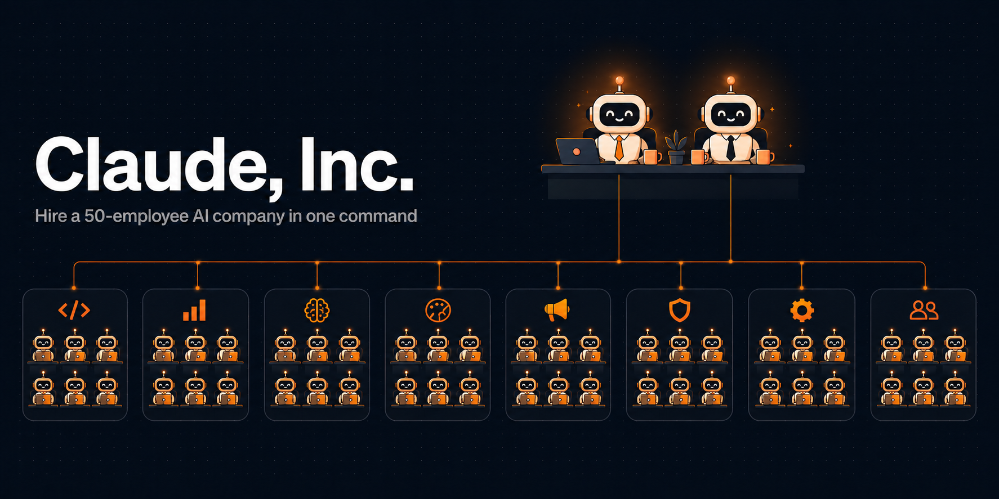
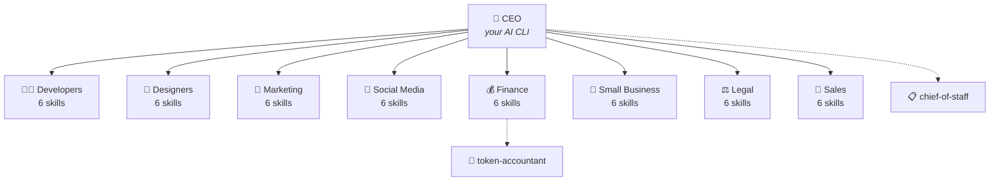
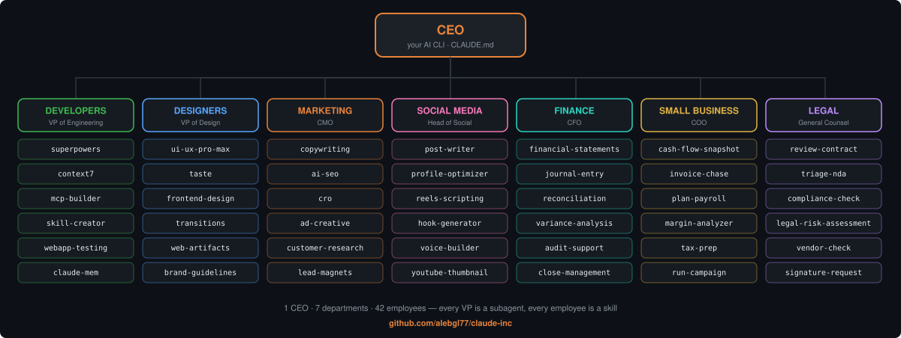

<div align="center">

# 🏢 Claude, Inc.

### Hire a whole AI company in one command.

**1 CEO · 8 departments · 50 employees, running inside Claude Code (or any AI CLI).**

[](https://github.com/alebgl77/claude-inc/actions/workflows/validate.yml)
[](LICENSE)


[-brightgreen.svg)](CONTRIBUTING.md)

*You are the founder. This repo is your payroll.*

</div>



---

## Why

Everyone screenshots the org-chart infographics. Nobody ships them.

**Claude, Inc.** turns the *"Build Your Whole Team with Claude"* org chart into a working company: every department is a real Claude Code **subagent**, every employee is a real **skill**, and the CEO is a routing brain that briefs them, parallelizes them, and reports back like a board memo.

*(The company includes a full Sales department on its 8th floor, plus a chief of staff and a token accountant on the executive floor. Headcount: 50.)*

No SaaS. No API keys. No framework. Just markdown with a job description - the way Claude was meant to be staffed.

## The org chart



You talk to the CEO. The CEO briefs the departments. The departments put their employees to work. You get files and a board memo. **That's the whole product.**

## Hire everyone in 60 seconds

**Option A - Claude Code plugin (recommended)**

```
/plugin marketplace add alebgl77/claude-inc
/plugin install claude-inc@claude-inc
```

**Option B - one-liner (installs skills + agents into `~/.claude`, plus the `company` CLI)**

```bash
curl -fsSL https://raw.githubusercontent.com/alebgl77/claude-inc/main/install.sh | bash
```

**Option C - clone and walk into the office**

```bash
git clone https://github.com/alebgl77/claude-inc && cd claude-inc
./install.sh --project   # hires the company into this project's .claude/
claude
/company <mission>       # invoke the installed CEO command explicitly
```

On Windows PowerShell, run `./install.ps1 -Project` from the clone instead. Run
`./install.ps1` without `-Project` for a global install. The `company` CLI
requires Bash (Git for Windows includes it); use `./install.ps1 -NoBin` to
install only the Claude Code files when Bash is unavailable.
With `--no-bin` or `-NoBin`, opt-in onboarding is deferred to the plugin because
the guarded profile-save CLI is intentionally not installed.

The shell installers record managed skills, agents and the `/company` command
in the target's `.claude-inc-manifest-v1`. When the `company` CLI is installed,
its global ownership is recorded separately in
`~/.claude/.claude-inc-cli-manifest-v1`. They acquire exclusive target and CLI
locks before taking snapshots or running the global preflight. An unmanaged
collision, a modified managed entry or a destination changed during the install
stops the transaction without overwriting that content. Move or back up the
reported conflict, then run the installer again.

A project install writes the CEO command to `.claude/commands/company.md`.
Start `claude` in that project, then run `/company <mission>` when you want CEO
routing; installing the files does not make the CEO context permanently active.

Team onboarding is optional. Plugin users can run `/onboard`. Installer users
can add `--onboard` to `install.sh` or `-Onboard` to `install.ps1`, or run it
later:

```bash
/onboard                    # plugin, project profile
/onboard --global           # plugin, global profile
company onboard             # CLI, project profile: .claude/company-team.md
company onboard --global    # CLI, global fallback profile
company team                # CLI, inspect the active profile
```

Onboarding asks three short questions, proposes the departments and skills to
activate, and keeps all 50 installed as the available bench. Project profiles
override global profiles. Existing installs and commands remain noninteractive
unless onboarding is explicitly requested.

`company brief` and the `/company` plugin command can use an active profile.
Both obtain only normalized scope, department and skill fields from the CLI
validator. They never read profile files directly. The free-form body and
stored research status remain local, never enter the prompt and never authorize
network access. An invalid project profile blocks global fallback.

Accepted profiles are saved only through the CLI helper. It refuses symbolic
links and non-regular targets, validates the fixed schema and 32768-byte limit,
uses a private temporary file in the profile directory, and replaces the target
atomically. Replacing a regular profile requires separate confirmation.

## Your first day as founder

```bash
# Brief the CEO: routes across departments, in parallel, returns a Board Memo
/company ship a landing page for my invoicing app, with pricing, legal-clean claims and 3 LinkedIn posts

# Morning standup: all 8 departments report on your current project
/standup

# Or talk to one department directly, from ANY terminal
company dev "my tests fail after the last refactor"
company legal "triage this NDA: $(cat nda.md)"
company marketing "10 ad variants for my beta launch"
```

Skills also fire on their own: say *"review this contract"* in any conversation and the Contract Reviewer shows up to work. The org chart is there when you need coordination, invisible when you don't.

## Meet the company

<details open>
<summary><b>👨‍💻 Developers</b> - VP of Engineering</summary>

| Employee | Role | Superpower |
|---|---|---|
| `superpowers` | Skill Forge | 14-skill power pack |
| `context7` | Docs Fetcher | Live library docs |
| `mcp-builder` | Tool Wright | Wire up MCP servers |
| `skill-creator` | Skill Smith | Build your own skills |
| `webapp-testing` | QA Engineer | Browser-test your app |
| `claude-mem` | Memory Keeper | Persistent memory |

</details>

<details>
<summary><b>🎨 Designers</b> - VP of Design</summary>

| Employee | Role | Superpower |
|---|---|---|
| `ui-ux-pro-max` | Design Lead | Full UI/UX system |
| `taste` | Taste Maker | Design-taste critic |
| `frontend-design` | Front of House | Build front-end UIs |
| `transitions` | Motion Artist | CSS motion library |
| `web-artifacts` | Prototyper | Live web prototypes |
| `brand-guidelines` | Brand Keeper | Build a brand kit |

</details>

<details>
<summary><b>📣 Marketing</b> - CMO</summary>

| Employee | Role | Superpower |
|---|---|---|
| `copywriting` | Word Smith | High-converting copy |
| `ai-seo` | Search Whisperer | Rank in AI search |
| `cro` | Conversion Lead | Lift conversion rates |
| `ad-creative` | Ad Maker | Ad headlines & visuals |
| `customer-research` | Voice of Customer | Synthesise user voice |
| `lead-magnets` | Bait Master | Build lead magnets |

</details>

<details>
<summary><b>📱 Social Media</b> - Head of Social</summary>

| Employee | Role | Superpower |
|---|---|---|
| `post-writer` | Ghostwriter | Write LinkedIn posts |
| `profile-optimizer` | Profile Doctor | Optimise your profile |
| `reels-scripting` | Reel Writer | Script your Reels |
| `hook-generator` | Hook Smith | Scroll-stopping hooks |
| `voice-builder` | Voice Coach | Clone your voice |
| `youtube-thumbnail` | Cover Tester | Test thumbnail covers |

</details>

<details>
<summary><b>💰 Finance</b> - CFO</summary>

| Employee | Role | Superpower |
|---|---|---|
| `financial-statements` | Statement Builder | Build the statements |
| `journal-entry` | Journal Keeper | Post journal entries |
| `reconciliation` | Reconciler | Reconcile the books |
| `variance-analysis` | Variance Analyst | Explain the variances |
| `audit-support` | Auditor | Prep for audit |
| `close-management` | The Closer | Run the close |

</details>

<details>
<summary><b>🏪 Small Business</b> - COO</summary>

| Employee | Role | Superpower |
|---|---|---|
| `cash-flow-snapshot` | Cash Watcher | Snapshot your cash |
| `invoice-chase` | Debt Chaser | Chase late invoices |
| `plan-payroll` | Payroll Planner | Plan payroll |
| `margin-analyzer` | Margin Analyst | Analyse margins |
| `tax-prep` | Tax Prepper | Prep your taxes |
| `run-campaign` | Campaign Runner | Run a campaign |

</details>

<details>
<summary><b>⚖️ Legal</b> - General Counsel</summary>

| Employee | Role | Superpower |
|---|---|---|
| `review-contract` | Contract Reviewer | Review any contract |
| `triage-nda` | NDA Triage | Fast NDA review |
| `compliance-check` | Compliance Officer | Check compliance |
| `legal-risk-assessment` | Risk Assessor | Flag legal risk |
| `vendor-check` | Vendor Vetter | Vet a vendor |
| `signature-request` | Signature Wrangler | Route for signature |

</details>

<details>
<summary><b>🤝 Sales</b> - VP of Sales <i>(Series A hire)</i></summary>

| Employee | Role | Superpower |
|---|---|---|
| `account-research` | Prospector | Actionable prospect intel |
| `draft-outreach` | Cold Emailer | Outreach that earns replies |
| `call-prep` | Deal Prepper | Walk into calls sharp |
| `proposal-builder` | Rainmaker | Proposals that close |
| `objection-handler` | Persuader | Turn pushback into progress |
| `pipeline-review` | Pipeline Doctor | Pipeline truth, weekly plan |

</details>

<details>
<summary><b>🏛️ Executive staff</b> - attached to the C-suite <i>(Series A hires)</i></summary>

| Employee | Reports to | Superpower |
|---|---|---|
| `chief-of-staff` | CEO | Mission ledger, decision log, weekly review |
| `token-accountant` | CFO | The company audits its own token payroll |

</details>

## How it works

The infographic maps 1:1 onto Claude Code primitives: no magic, just org design:

| On the org chart | In this repo | Mechanism |
|---|---|---|
| **CEO** | `commands/company.md` + `/company` | Routing brain: parses the mission, delegates, arbitrates, writes the Board Memo |
| **8 departments** | `agents/*.md` | Subagents with their own context windows; they run **in parallel** |
| **48 employees** | `skills/*/SKILL.md` | Skills with trigger-rich descriptions; VPs hire them per task, or they self-trigger |
| **2 staff hires** | `chief-of-staff`, `token-accountant` | Attached to CEO and CFO: org memory and self-auditing of token spend |

```
you ──mission──▶ CEO ──briefs──▶ VP(s) ──hire──▶ skill(s) ──ship──▶ files + Board Memo
```



Every employee follows the same contract: **When to use → Workflow → Output format → Quality bar → Example.** That's what makes all 50 manageable and PRs reviewable.

And the company audits itself: `python3 scripts/validate.py` (run in CI on every push) checks every job description, cross-references the CLI roster against the departments, and fails the build if an employee is hired twice, orphaned, or missing from the docs.

## Works with any CLI

The `company` CLI composes fully self-contained prompts (department charter + all 6 employee manuals + your task). If `claude` is installed it runs it; otherwise pipe it anywhere:

```bash
company roster                                   # meet the team
company team                                     # show active routing preferences
company onboard --print                          # inspect the onboarding prompt
company brief "launch my product"                # CEO mode
company finance "reconcile bank.csv vs ledger.csv"
company design "critique screenshot.png" --print | gemini   # any engine
CLAUDE_INC_ENGINE=codex company dev "add tests"              # or set an engine
```

No Claude Code? No problem. The hierarchy travels as plain text.

### Skill-gap research

Onboarding can flag missing capabilities. It researches candidates only after
separate, explicit consent and returns suggestions only. Each candidate is
checked for source quality, current maintenance, compatibility, documentation,
license, security, third-party adoption and available performance evidence.
Stars include a collection date and never decide the ranking alone. Remote
content is inspected read-only, treated as untrusted and never saved locally.
Candidates fail if they are abandoned, opaque, unauditable, insecure,
incompatible or poorly documented. No third-party content is downloaded,
copied, installed or executed.

## FAQ

**Is this over-engineering?** For "fix a typo", yes, which is why skills also trigger individually and the CEO skips ceremony on single-department tasks. For "prepare my product launch", a parallel org beats one long chat every time.

**Does `/company` burn tokens?** Departments are subagents with their own context, so big missions fan out real work. Brief the CEO like you'd brief a real one: clear scope, only the departments you need.

**Finance/Legal outputs?** Decision support with mandatory disclaimers, not professional advice. The VPs are contractually incapable of forgetting this.

**Can I hire more employees?** Yes: [we're hiring](CONTRIBUTING.md). One PR = one new employee.

## Credits

- Org chart concept: **[Build Your Whole Team with Claude](https://charliehills.substack.com)** by Charlie Hills; this repo is the runnable formalisation of that map.
- Some employees are self-contained homages to great ecosystem projects: [obra/superpowers](https://github.com/obra/superpowers), [Context7](https://github.com/upstash/context7), claude-mem.
- Built with [Claude Code](https://docs.claude.com/en/docs/claude-code) subagents, skills and plugins.

## License

[MIT](LICENSE) - take the whole company, it's yours.

---

<div align="center">

**If your new workforce ships something, [⭐ star the company](https://github.com/alebgl77/claude-inc) - it's cheaper than payroll.**

</div>
